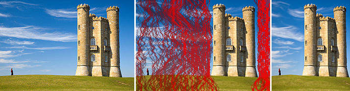
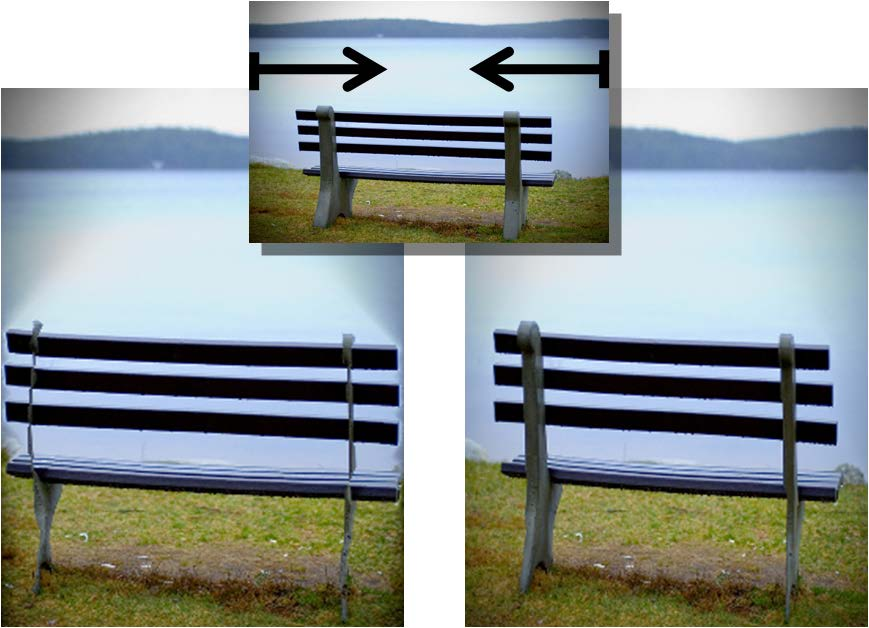
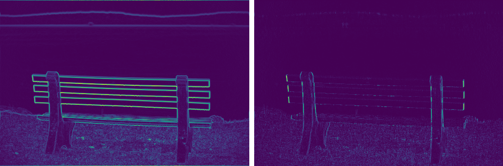
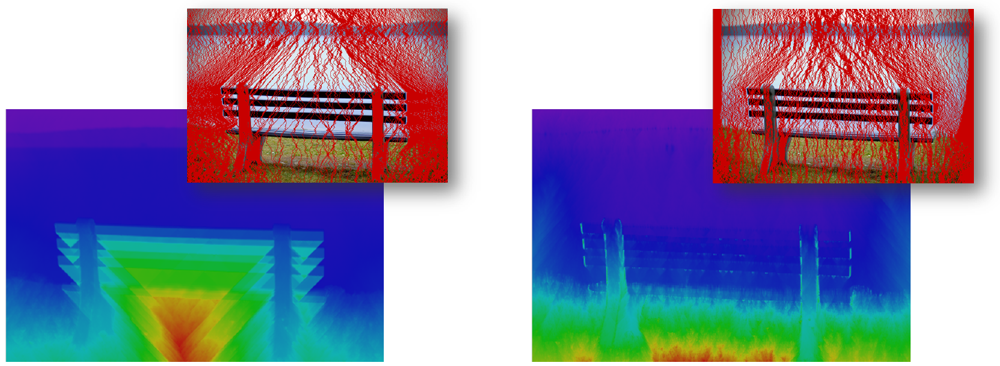

After reading the readme, you can view the notebook here for the implementation:

https://nbviewer.jupyter.org/github/axu2/improved-seam-carving/blob/master/Improved%20Seam%20Carving.ipynb

# Improved Seam Carving Using Forward Energy

>Seam-carving is a content-aware image resizing technique where the image is reduced in size by one pixel of height (or width) at a time. A vertical seam in an image is a path of pixels connected from the top to the bottom with one pixel in each row. Unlike standard content-agnostic resizing techniques (such as cropping and scaling), seam carving preserves the most interesting features (aspect ratio, set of objects present, etc.) of the image.

>

Above left is the original 714-by-186 pixel image; above middle are the vertical seams; above right is the result after removing 554 vertical seams.

This technique is taught in many CS curriculums, including CS 61B at UC Berkeley and [mine](https://www.cs.princeton.edu/courses/archive/spring16/cos226/assignments/seamCarving.html). 

But these classes neglect to mention the improved seam carving algorithm, published the year after the original.

The difference between the original and the improved can be seen below after carving 200 seams on a 512-by-342 bench image.

The left is the original seam carving algorithm and the right is the improved algorithm:

It took 3 seconds using the original seam carving method and 14 seconds using the improved method, tested on a nondescript Windows laptop using [Anaconda Python 3.6](https://www.anaconda.com/download/).

The improved method preserves the gradient of the water and the bench supports much better, and the result is similar to what happens in Adobe Photoshop.

In this notebook, I will be implementing both methods using numpy and scikit-image.

I believe my implementation of the second method is more optimal than any other implementation I've seen on Google or GitHub, though I note more potential optimizations in the notebook.

[I hope to add it to scikit-image.](https://github.com/scikit-image/scikit-image/issues/3082)

## Implementation Details

For more details, read the original [seam carving paper](http://www.faculty.idc.ac.il/arik/SCWeb/imret/index.html) 
and the [Improved Seam Carving](http://www.faculty.idc.ac.il/arik/SCWeb/vidret/index.html) paper, where the above photo is from.

Both papers introduce different ways to "calculate the energy of a pixel, which is a measure of its importance—the higher the energy, the less likely that the pixel will be included as part of a seam."

The first paper determined the energy of a pixel using some edge detection algorithm.

The second paper determined the energy of a pixel by calculating the gradient of the new edges that are introduced in the image after removing a seam containing that pixel.

The two resulting energy maps of the bench image using the two methods look like this, where higher energy pixels are brighter:

As you can see, seams will not want to pass through the bench using backwards energy, which causes severe artifacts. 

Here is an image of the resulting seams and accumulated energy matrices from the paper:

## Examples

